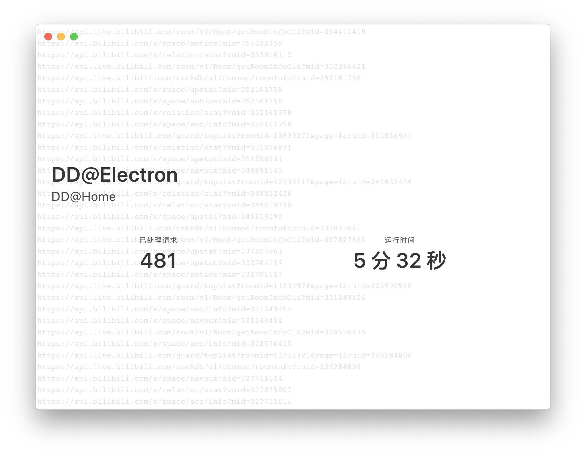

# DDatElectron
***DD@Home*** 分布式项目, 桌面客户端 DD@Electron

#### 下载

Windows: <http://dd.center/api/update/ddatelectron/ddatelectron-Setup-1.1.1.exe>

macOS: <http://dd.center/api/update/ddatelectron/ddatelectron-1.1.1.dmg>

Linux: <http://dd.center/api/update/ddatelectron/ddatelectron-1.1.1.AppImage>

Github Release: <https://github.com/dd-center/DDatElectron/releases/latest>



Cluster Manager, Protocol, available clients: <https://github.com/dd-center/Cluster-center>

### 用到的部分开源项目

* [Node.js](https://nodejs.org/) JavaScript 运行时
  * [level](https://www.npmjs.com/package/level) LevelDB数据库
  * [got](https://www.npmjs.com/package/got) http
  * [ws](https://www.npmjs.com/package/ws) WebSocket
* [Electron](https://electronjs.org) 桌面应用
  * [Vue.js](https://vuejs.org) 前端框架
  * [Bulma](https://bulma.io) CSS
  * [moment](https://momentjs.com) 时间显示
  * [electron-builder](https://www.electron.build) 打包

## 开发

#### 安装

```sh
npm install
```

#### 运行

```sh
npm run start
```

#### 编译并打包可执行文件

```sh
npm run build
```

